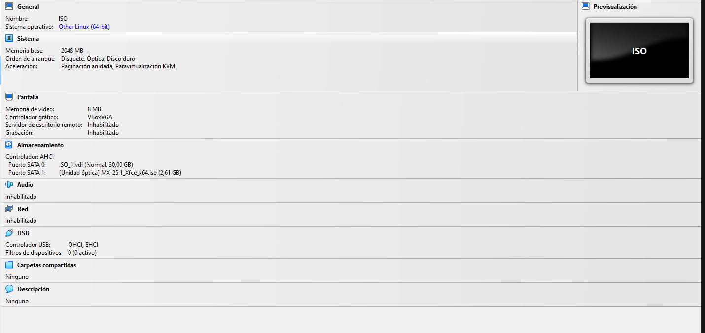
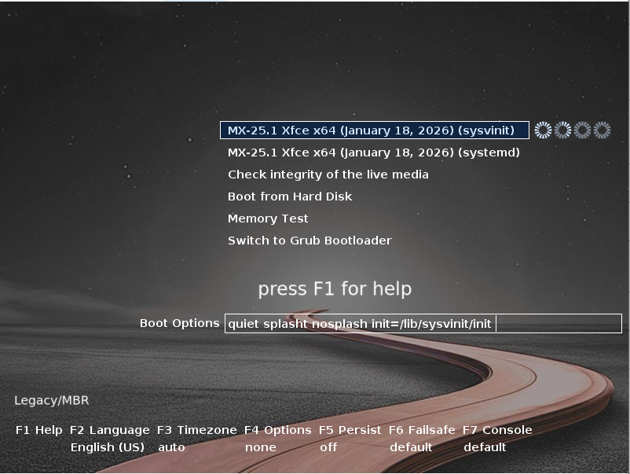
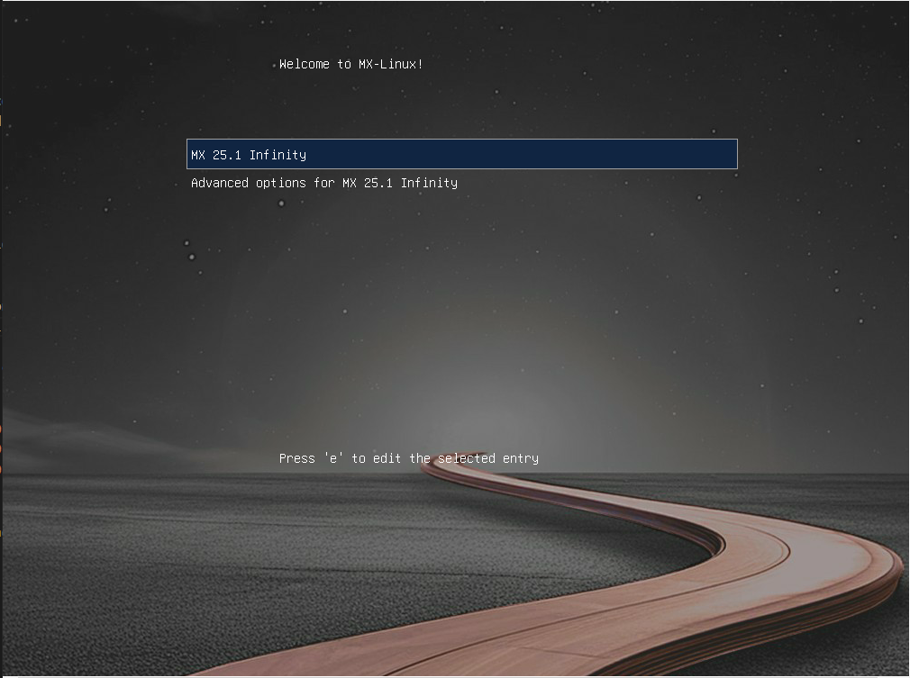

# Prueba ISO 01

## 1. Datos generales

- **Nombre de la ISO probada:**MX
- **Fecha:**13/04/2026
- **Software de virtualización:**Oracle VirtualBox

## 2. Configuración de la VM

- **CPU:**1
- **RAM:**2GB
- **Disco virtual:**30GB
- **Controlador de almacenamiento:** AHCI(SATA)
- **Red:**Sin controlador de red
- **Audio / vídeo /:**
  **Audio:**Desactivado
  **vídeo:**8MB

## 3. Resultado del arranque

A entrado en un grub para selecionar que queria hacer se le puede cambiar el idioma facilmente dandole al F2

## 4. Resultado del instalador
Para entrar al instalador primero debes de entrar en el live y encontrar el instalador en el caso de MX esta en el escritorio
Es bastante sencillo te selecciona el disco duro automatico porque no detecta ninguno mas. Te da una opcion de crear una particion swap la creara predeterminado si le damos a siguiente la verdad es que es muy facil de instalar y rapido

## 5. Resultado final

Explica si la instalación se ha completado y si el sistema arranca.
El sistema arranca con normalidad. Nada mas arrancar te saldra su grub.
Con la poca capacidad de memoria y solo un procesador que tiene la verdad es que va bastante rapido sin embargo tambien hay que pensar que tiene mucha mas frecuencia de la que tendra el ordenador fisico.

## 6. Capturas relacionadas

- Configuracon Maquina virtual

- Inicio de la imagen ISO
  
- Inicio despues de la instalación
  
- Escritorio del sistema operativo ya instalado
  

## 7. Valoración

Me parece la mas adecuada por que ademas de ser ligera tiene una interfaz de usuario bastante sencilla
