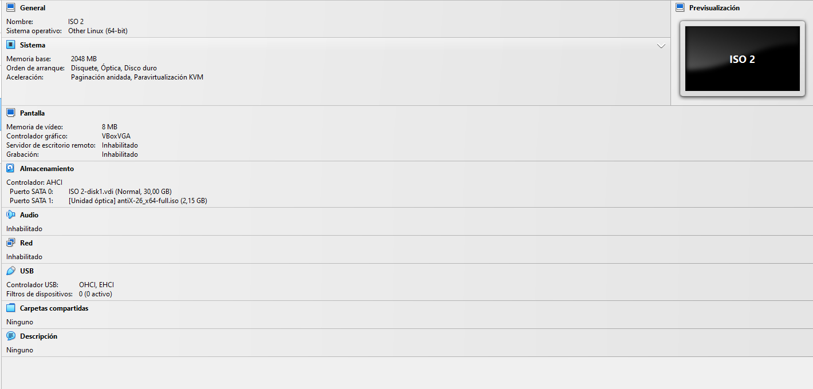
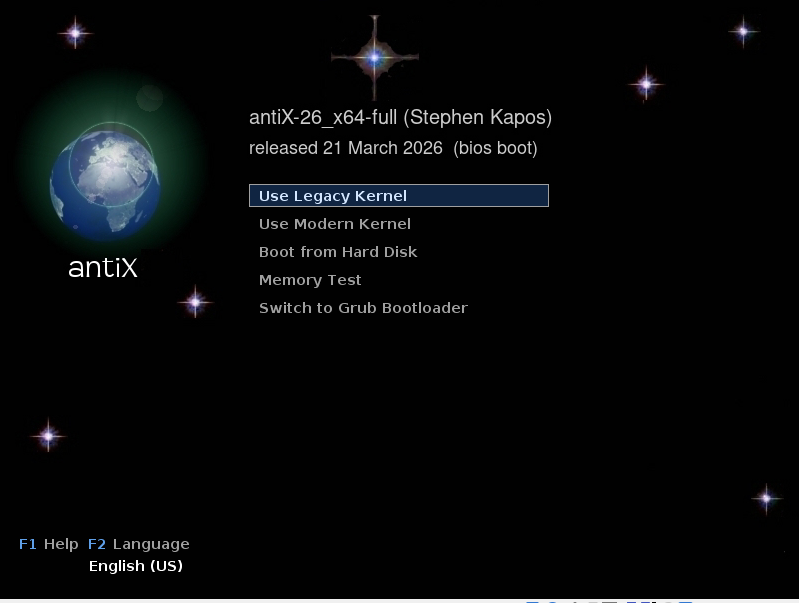
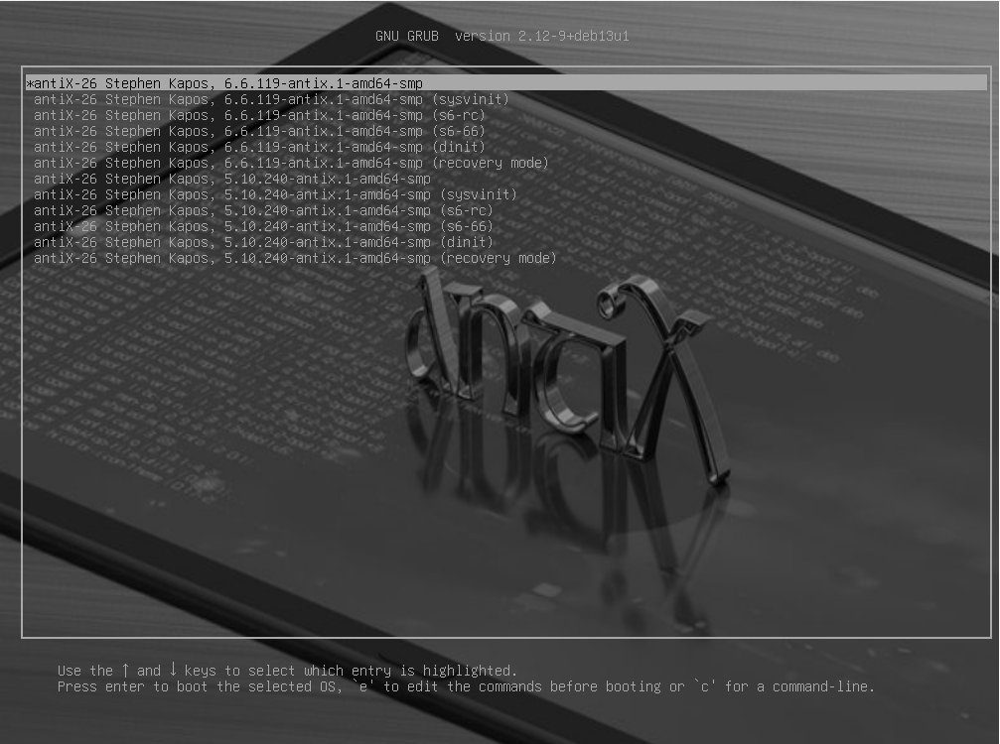
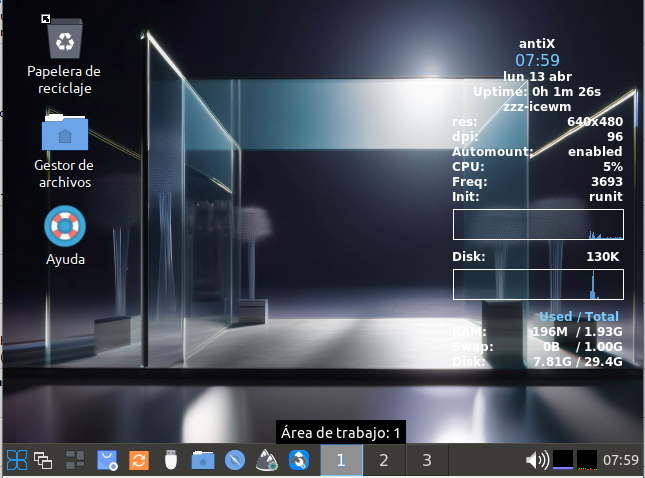
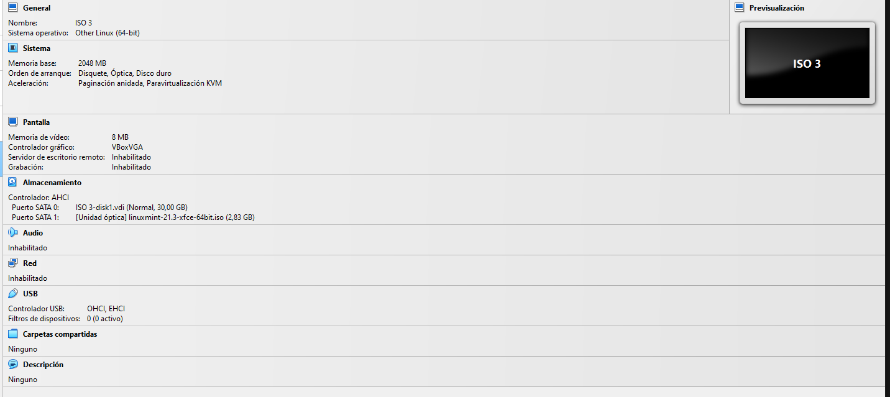
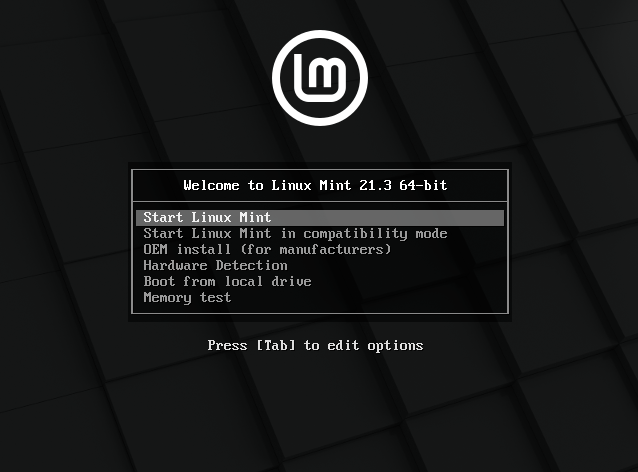
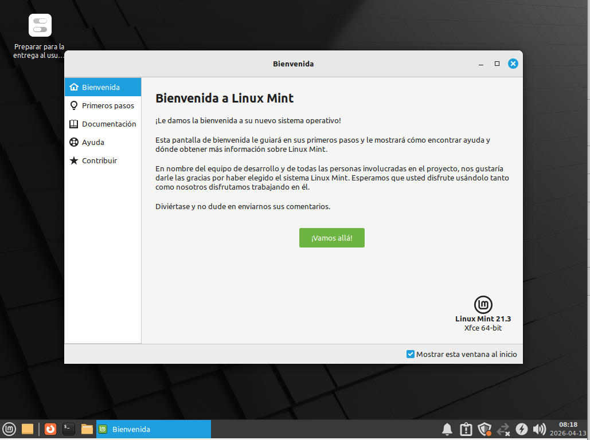

# ENTREGA ÚNICA · Reto 01

> Este documento reúne toda la información necesaria para exportar la entrega final a PDF.

---

## 1. Portada

**Alumno/a:**Yllán Cazorla Más
**Grupo:**1
**Curso:** 1ºASIR
**Fecha:**13/04/2026

---

> En este reto se analiza un equipo real, se seleccionan 3 ISOs Linux adecuadas y se prueban las 3 en una máquina virtual antes de pasar al aula taller.

## 2. Introducción

En este reto se plantea una situación parecida a la de un taller técnico real: antes de instalar un sistema en un equipo antiguo, conviene preparar varias opciones y comprobarlas.

El equipo objetivo es un **HP Compaq dc7800**, un ordenador veterano que puede presentar limitaciones de hardware. Por ello, en lugar de apostar por una sola distribución, se seleccionan varias **ISOs Linux ligeras** y se validan previamente en una **máquina virtual**.

La idea es parecida a llevar tres llaves para una cerradura vieja: puede que la primera abra a la primera, puede que otra se atasque, y puede que una tercera sea la que finalmente permita trabajar sin problemas. Por eso en este reto se eligen **tres candidatas**, se comparan y se prueban.

Los objetivos concretos son:

- analizar el hardware del equipo real;
- seleccionar tres distribuciones Linux razonables;
- justificar técnicamente cada elección;
- probar las tres en una VM;
- documentar resultados con capturas;
- decidir un orden de instalación para el aula taller.

## 3. Análisis del equipo real

**HP Compaq dc7800 (PC Equipo 1)**
**CPU: Intel Core 2 Duo E6750 (x64, 2 núcleos / 2 hilos)*

**RAM: DDR2 (Aprox. 3GB en 4 módulos mixtos)**

**Almacenamiento: HDD 160GB**

**Puertos: 8 USB (6 traseros, 2 frontales) y red RJ45 (estado sin verificar)**

## 4. Selección de las 3 ISOs

### 4.1 Criterios usados

Ligera y que pudiera funcionar en un sistema de bajos recursos y que sea facil para el usuario.
Maximo de memoria requerida:2GB
que sea compatible con procesadores arquitectura x64

### 4.2 Tabla comparativa

| **ISO**                 | **Versión** | **Arquitectura** | **RAM mínima** | **Disco mínimo** | **Tamaño ISO** | **Ventajas**                                                       | **Inconvenientes**                                              | **Decisión**         |
| ------------------------- | -------------- | ------------------ | ----------------- | ------------------- | ----------------- | -------------------------------------------------------------------- | ----------------------------------------------------------------- | ----------------------- |
| **ISO 01 (AntiX)**      | 26           | x64              | 512 MB          | 7.0 GB            | 2.1 GB          | Muy ligero, instalación sencilla y suite ofimática preinstalada. | Incertidumbre sobre la fluidez según la frecuencia de la RAM.  | **Alternativa**       |
| **ISO 02 (MX Linux)**   | 25.1         | x64              | 1 GB            | 8.5 GB            | 2.7 GB          | Basado en AntiX pero más orientado al usuario final.              | Posibles conflictos de estabilidad con mezclas de módulos RAM. | **Opción principal** |
| **ISO 03 (Linux Mint)** | 21.3         | x64              | 2 GB            | 20 GB             | 2.8 GB          | Muy fácil de usar, interfaz familiar tipo Windows.                | Es la distribución que más recursos de hardware demanda.      | **Respaldo**          |

### 4.3 Ficha resumida de ISO 01

* **Distribución:** AntiX
* **Versión:** 26
* **Motivo de elección:** Pocos requisitos, instalación sencilla, y la versión *full* viene con una suite de ofimática preinstalada, lo cual evita tener que instalar más software y permite usar el sistema de forma óptima desde el principio.
* **Papel dentro del plan:** Alternativa

### 4.4 Ficha resumida de ISO 02

* **Distribución:** MX
* **Versión:** 25.1
* **Motivo de elección:** Es una versión mejorada de AntiX, con un enfoque más orientado al usuario, aunque requiere más recursos.
* **Papel dentro del plan:** Opción principal

### 4.5 Ficha resumida de ISO 03

* **Distribución:** Linux Mint
* **Versión:** 21.3
* **Motivo de elección:** Fácil uso e instalación, con un entorno gráfico y un manejo muy parecido a un sistema Windows.
* **Papel dentro del plan:** Respaldo

## 5. Configuración de la máquina virtual

## Software utilizado
- **Aplicación:Oracle VirtualBox**  
- **Versión:**7.1.4  
## Configuración aplicada
- **CPU:**1  
- **RAM:**2GB 
- **Disco virtual:**30GB  
- **Controlador de almacenamiento:** AHCI(SATA) 
- **Red:**Sin controlador de red 
- **Audio / vídeo /:**
**Audio:**Desactivado  
**vídeo:**8MB
## 6. Resultados de las pruebas

### 6.1 ISO 01(MX)
#### 3. Resultado del arranque

A entrado en un grub para selecionar que queria hacer se le puede cambiar el idioma facilmente dandole al F2

#### 4. Resultado del instalador
Para entrar al instalador primero debes de entrar en el live y encontrar el instalador en el caso de MX esta en el escritorio
Es bastante sencillo te selecciona el disco duro automatico porque no detecta ninguno mas. Te da una opcion de crear una particion swap la creara predeterminado si le damos a siguiente la verdad es que es muy facil de instalar y rapido

#### 5. Resultado final

Explica si la instalación se ha completado y si el sistema arranca.
El sistema arranca con normalidad. Nada mas arrancar te saldra su grub.
Con la poca capacidad de memoria y solo un procesador que tiene la verdad es que va bastante rapido sin embargo tambien hay que pensar que tiene mucha mas frecuencia de la que tendra el ordenador fisico

#### 6. Capturas relacionadas

- Configuracon Maquina virtual

- Inicio de la imagen ISO
  
- Inicio despues de la instalación
  
- Escritorio del sistema operativo ya instalado
  

### 6.2 ISO 02(antiX)

#### 3. Resultado del arranque
A entrado en el grub para selecionar que quieres hacer. se le puede cambiar el idioma facilmente dandole al F2

#### 4. Resultado del instalador
Al ser el padre de MX funciona exactamente igual la forma de instalarlo lo unico que cambia es que aunque cambies el idioma no te detecta que al poner el idioma español de españa eres de españa y te toca cambiarlo otra vez al entrar el el instalador
Para entrar al instalador primero debes de entrar en el live y encontrar el instalador en el caso de antiX esta en el escritorio
Es bastante sencillo te selecciona el disco duro automatico porque no detecta ninguno mas. Te da una opcion de crear una particion swap la creara predeterminado si le damos a siguiente la verdad es que es muy facil de instalar y rapido

#### 5. Resultado final
El sistema inicia sin ningun fallo al igual que MX funciona bastante fluido pero hasta que no se pruebe con la verdadera maquina no se sabe.
#### 6. Capturas relacionadas
- Configuración Maquina virtual

- Inicio ISO

- Inicio grub despues de la instalacion del SO

- Escritorio inicio

### 6.3 ISO 03

#### 3. Resultado del arranque
Abre un grup para selecionar que deseas iniciar.

#### 4. Resultado del instalador
Para instalar esta vez no necesitaremos entrar en el live(modo prueva) para instalarlo ya que este cuenta con una opcion de instalacion directa.
A diferencia que los otros 2 sistemas operativos este no te crea automaticamente una particion swap para eso deberas crear tu mismo la tabla de particiones de ser necesario. Tampoco instala un grub
#### 5. Resultado final
Tiene inicio rapido de sistema operativo lo cual hace que no use un grub para poder ponerle un grub tienes que selecionar que quieres intalar un grub.
#### 6. Capturas relacionadas
- Configuración maquina virtual

- Grub de inicio ISO

- Inicio sistema operativo

## 7. Conclusión final

- **ISO principal:**MX Requisitos bajos y facil para el usuario
- **ISO alternativa:**antiX Requisitos muy bajos y preinstalada suit ofimatica.
- **ISO problemas BIOS antigua:**antiX instalada por medio de rufus
- **ISO Emergencia:**Linux mint Requisitos bajos pero es la que mas requisitos pide el ordenador de la practica le deberia dar de sobra para usarla pero puede tener menos rendimiento que las otras 2. Es la de emergencia por usar un Linux mas simple y compatible.
Ya que las 2 ISO anteriores usan la misma arquitectura si por lo que sea diera fallos se usaria mint por usar una arquitectura mas compatible.
Mi decisión se a basado en intentar usar los sistemas operativos con menos requisitos como las principales.
## 8. Bibliografía

- **antiX Linux** 
 **Enlace oficial de descarga:** [SourceFORGE](https://sourceforge.net/projects/antix-linux/files/Final/antiX-26/antiX-26_x64-full.iso/download)
 **Web o documentación oficial:**[AntiX](https://antixlinux.com/)

- **MX** 
 **Enlace oficial de descarga:**[MX](https://sourceforge.net/projects/mx-linux/files/Final/Xfce/MX-25.1_Xfce_x64.iso/download)
 **Web o documentación oficial:**[MX](https://mxlinux.org/)
- **Linux Mint**
 **Enlace oficial de descarga:**[Mint](https://linuxmint.com/edition.php?id=313)
 **Web o documentación oficial:**[Mint](https://linuxmint.com/edition.php?id=313)
Los rquisitos de linux mint no los encontraba en pagina oficiales.
## Fuentes utilizadas por el grupo
-  [PC](https://h10032.www1.hp.com/ctg/Manual/c01168616.pdf)
  
