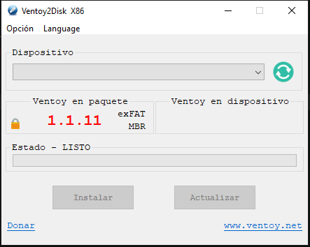

# Proyecto de FHW · RA3 · UT5

## Reto 02
# Instalación de Linux en HP Compaq dc7800 mediante Ventoy

**Alumno/a:**Yllan Cazorla Más  
**Grupo:**1  
**Curso:**1º ASIR 
**Fecha:**24/04/2026  

---

> En este reto se prepara un USB con Ventoy, se dejan cargadas las 3 ISOs seleccionadas en el Reto 01 y se instala al menos una de ellas en el equipo real HP Compaq dc7800, documentando todo el proceso.

