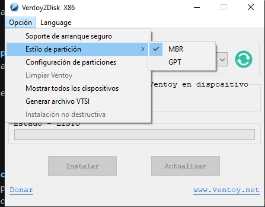
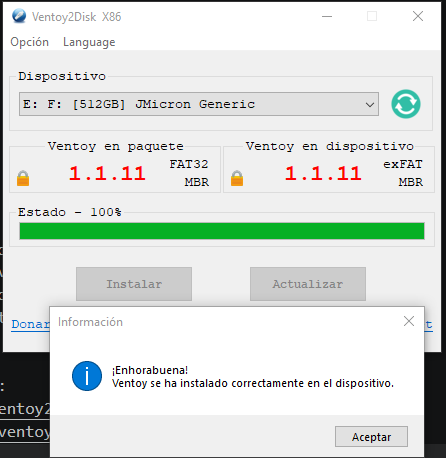
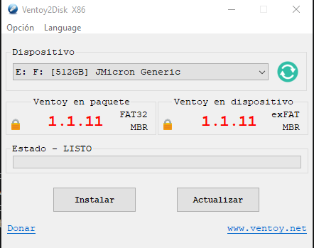

# Ficha · Preparación del USB con Ventoy

## 1. Datos básicos del pendrive
- Marca y modelo:Disco duro externo marca UnionSine y modelo HD2510
- Capacidad:500GB
- Sistema desde el que se preparó:Windows 10

## 2. Preparación de Ventoy
- Programa utilizado:Ventoy
- Versión de Ventoy:1.1.11
- Pasos seguidos para instalar Ventoy en el USB:
  1.Poner esquema de particiones MBR 
  2.Quitar secure boot
  3.Configurar las particiones como FAT32
  

## 3. Precauciones tomadas
- ¿Se comprobó que el USB correcto era el seleccionado?
- ¿Se hizo copia de seguridad de los datos del pendrive antes de formatearlo?
No porque la informacion no era importante para el propietario(YO).
- ¿Se verificó que Ventoy quedó instalado correctamente?
Si usando mi PC
## 4. Evidencias
- Captura o foto del proceso de instalación de Ventoy:

- Captura o foto del contenido del USB ya preparado:

- Observaciones:
- Rehacer ventoy

## 5. Valoración
En mi caso se me olvido cambiar las particiones y por eso no funcionaba. Pero por si acaso llevaba un Rufus totalmente funcional y en el ventoy llevaba su instalador por si fallaba. Al final fallo porque usaba exfat pero se pudo instalar usando mi rufus de emergencia y se probo con otro ventoy bien particionado.