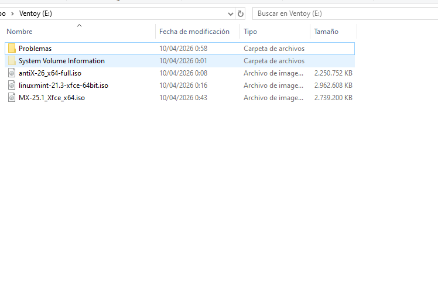
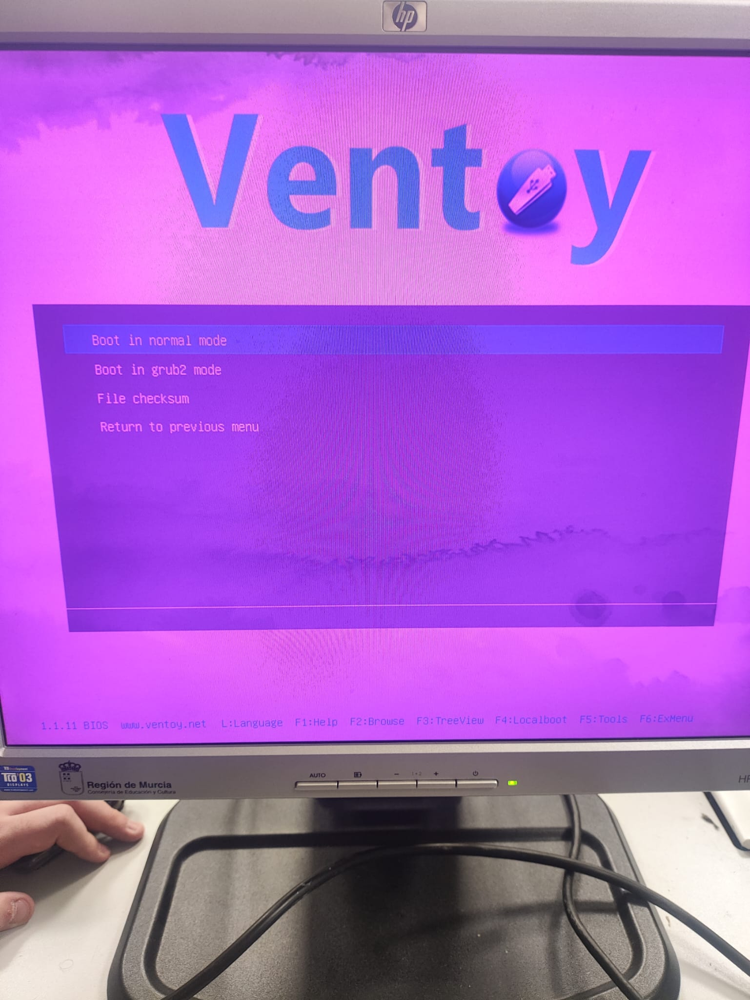
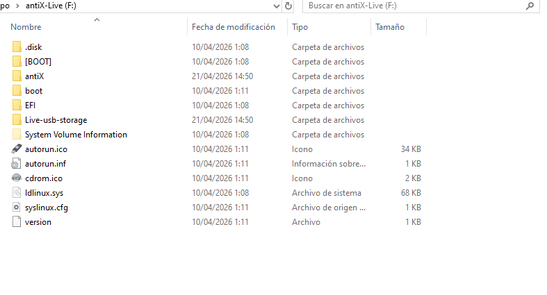

# Ficha · Relación de ISOs copiadas en el USB

## ISO 01
- Distribución:Antix linux
- Versión:26
- Nombre del archivo ISO:antiX-26_x64-full.iso
- Papel previsto: alternativa

## ISO 02
- Distribución:MX
- Versión:25.1
- Nombre del archivo ISO:MX-25.1_Xfce_x64.iso
- Papel previsto: Principal

## ISO 03
- Distribución:Linux Mynt
- Versión:21.3
- Nombre del archivo ISO:linuxmint-21.3-xfce-64bit.iso
- Papel previsto:alternativa

## ISO 01
- Distribución:Antix linux
- Versión:26
- Nombre del archivo ISO:antiX-26_x64-full.iso
- Papel previsto: Respaldo
- Explicacion: Es mi respaldo porque lo llevo con otro USB instalada con rufus que tiene mas compatibilidad que ventoy con sistemas antiguos el unico problema que no permite usar mas de una iso.
## Evidencias
- Captura del explorador mostrando las 3 ISOs copiadas:

- Captura del menú de Ventoy donde aparezcan las 3 ISOs:Al final no use el mio con ventoy si no el de rufus porque estaba mal particionado y como el ventoy de mi grupo llevaba mis 2 alternativas:Antix y Mynt nunca la hice al mio.

- Rufus de respaldo usado:
