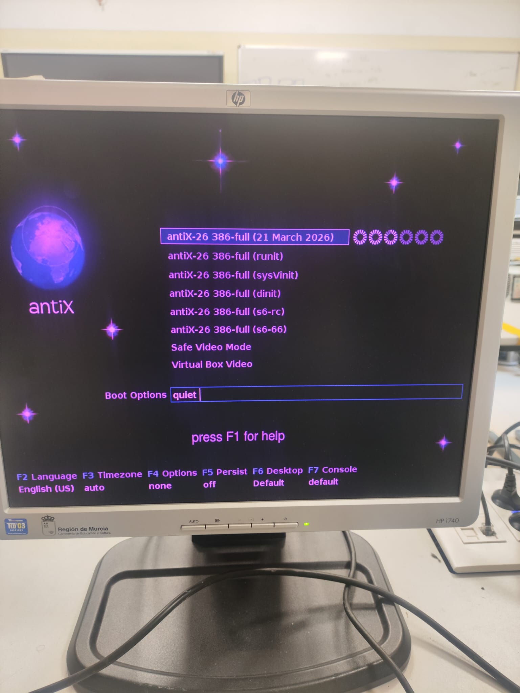
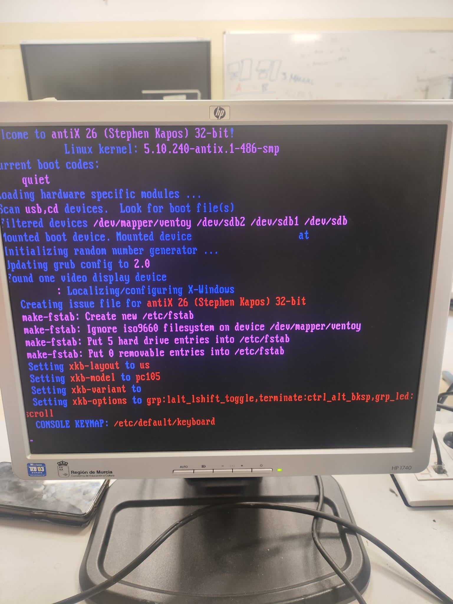
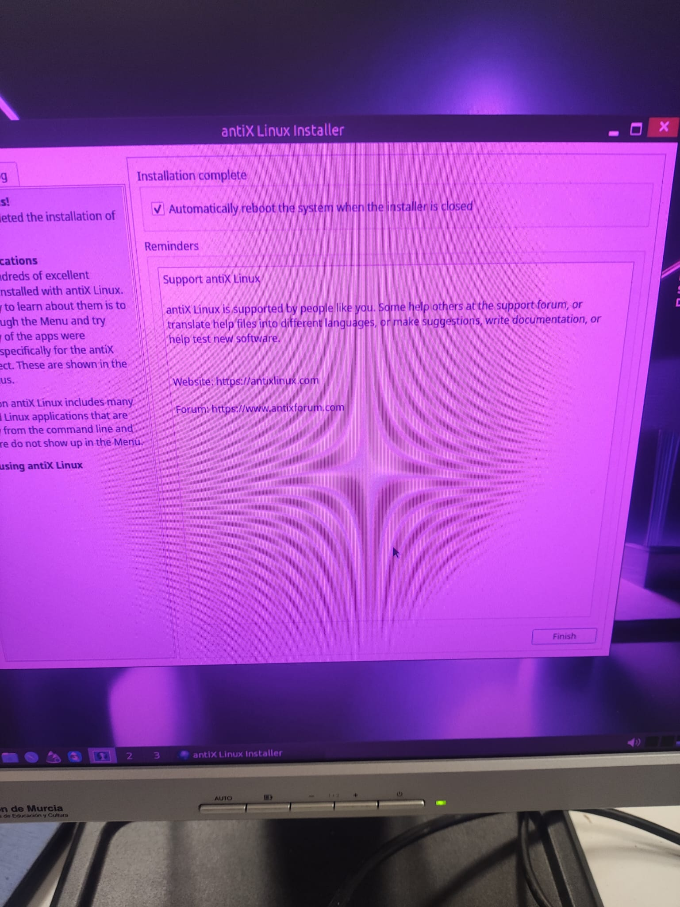
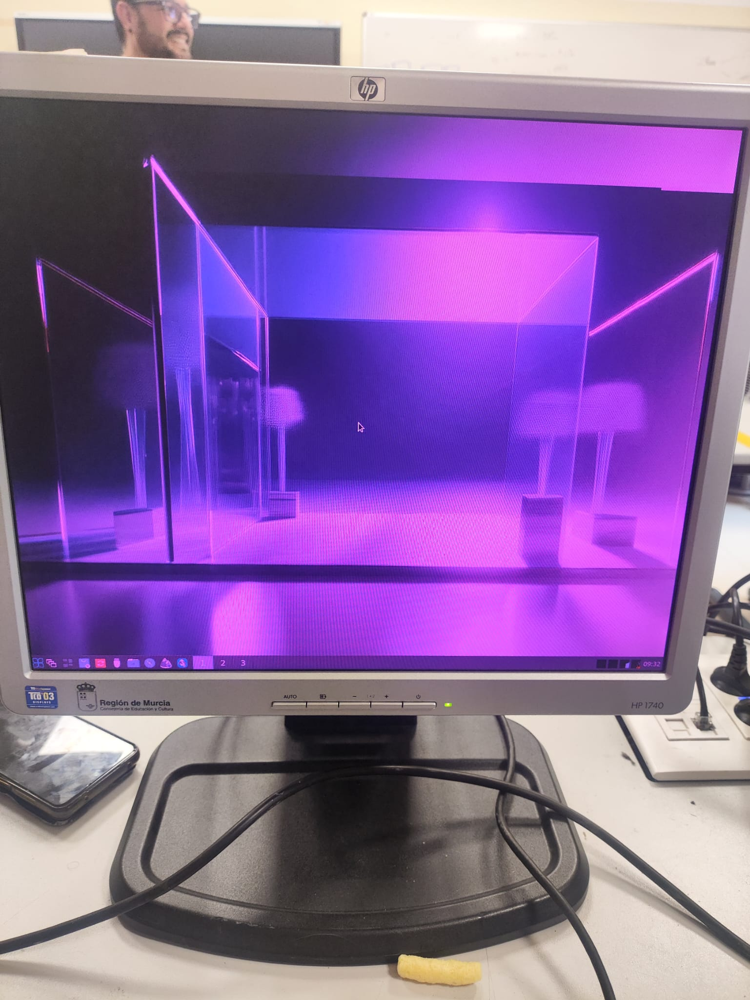

# Ficha · Intento de instalación 1

## 1. Datos básicos
- ISO utilizada:Antix
- Fecha y hora aproximada:15:30
- Puesto dentro del plan:alternativa

## 2. Arranque
- ¿Se seleccionó la ISO desde Ventoy?
Si
- ¿La ISO arrancó correctamente?
Si
- Evidencia:

## 3. Instalación
- ¿Se llegó al instalador?
Si
- Tipo de instalación elegido:Instalacion guiada en todo el disco y con particion swap
- Esquema de particionado usado: Automatico con particion swap
  
- Pasos principales realizados(TODOS LOS RELEVANTES):
  1.Selecionar: usar todo el disco.
  2.Selecionar: Create swap file
  3.Cambiar la ubicacion y el idioma a España Madrid
  4.Colocar una contraseña para el administrador

## 4. Resultado del intento
- ¿La instalación finalizó correctamente?
Si
- ¿El sistema arrancó después?
Si
- Estado final: éxito

## 5. Problemas encontrados
- Inicio automatico desde USB
## 6. Soluciones aplicadas
- Solución 1: Desconectar el USB o cambiar el orden de arranque

## 7. Decisión tomada
Se continua usando esta ISO porque decidimos probar otros sistemas operativos y este fue el que mejor funciono
## 8. Evidencias
- Captura de arranque:
- Captura del instalador:

- Captura del resultado final o del error:
