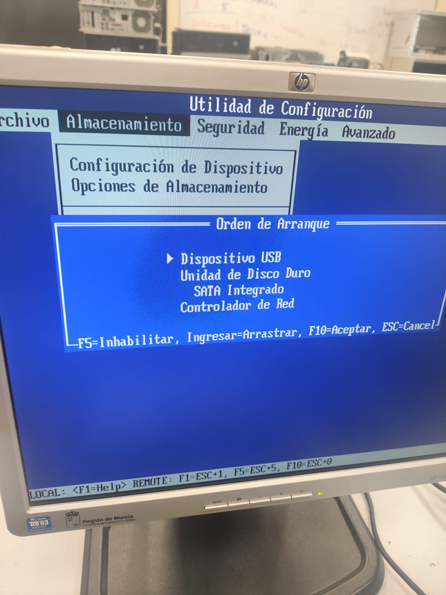

# Ficha · Registro general de la instalación

## 1. Datos de la sesión de trabajo
- Fecha:15:30
- Aula o taller:Taller
- Miembros del grupo:Yllán, Abraham, Alfonso y Miguel
- Equipo utilizado: HP Compaq dc7800

## 2. Preparación previa
- ¿El USB con Ventoy estaba listo?
Si pero no funcionaba
- ¿Estaban copiadas las 3 ISOs?
Si
- ¿Se sabía el orden de intento?
Si

## 3. Arranque del equipo
- Tecla o método usado para seleccionar el arranque:
f9
- ¿Entró correctamente en el menú de arranque?
Si
- ¿Se detectó el USB?
Si
- ¿Ventoy arrancó correctamente?
Si
## 4. Resultado global
- ISO finalmente instalada:Antix
- ¿La instalación terminó correctamente?
Si
- ¿El sistema arranca después de instalar?
Si
- Observaciones generales:Funciona y fluido si se quisiera instalar un sistemas con mas recursos se deberia de instalar mas memoria RAM en el ordenador.

## 5. Evidencias clave
- Foto o captura del menú de arranque:

- Foto o captura del menú de Ventoy:

- Foto o captura del sistema ya instalado:
