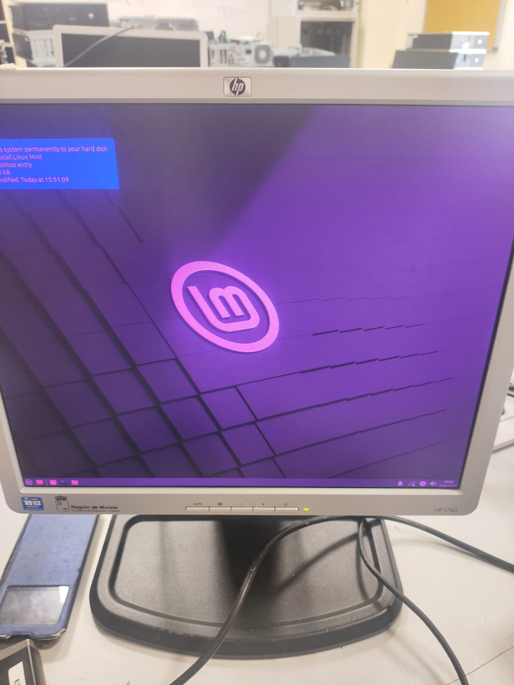

# ENTREGA ÚNICA · Reto 02

> Este documento reúne toda la información necesaria para exportar la entrega final a PDF.

---

## 1. Portada

- Alumno/a:Yllán Cazorla Más
- Grupo:1
- Curso:1º ASIR
- Fecha:24/04/2026

## 2. Introducción

Pasar de las pruebas en máquinas virtuales a la instalación física de Linux en un ordenador HP Compaq dc7800.

Estrategia de Instalación

Herramienta: Crear un USB multiarranque utilizando Ventoy.

Mochila Técnica: Copiar al USB las tres ISOs elegidas en el reto anterior. Esto permite tener opciones de respaldo inmediatas en el aula taller si la primera o segunda distribución fallan, evitando tener que volver a configurar el pendrive.

## 3. Preparación del USB con Ventoy

### 3.1 Datos del pendrive
- Marca y modelo:Disco duro externo marca UnionSine y modelo HD2510
- Capacidad:500GB

### 3.2 Preparación de Ventoy
Se instalo poniendo esquema de particiones MBR, configurando las particiones para FAT32 aunque cuando se hizo la prueba en el taller use EXFAT.
### 3.3 Relación de ISOs en el USB
- ISO 01:Antix
- ISO 02:MX
- ISO 03:Mynt

### 3.4 Evidencias
- Captura del contenido del USB:

- Captura del menú de Ventoy:

No se le hecho foto al mio ya que el mio no funcionaba en los del taller aunque si funcionaba mi USB de respaldo pero al ser un rufus no tiene menu.

## 4. Plan de instalación

### 4.1 Orden previsto de intento
- Primera opción:Antix
- Segunda opción:Mynt
- Tercera opción:Bodhy

### 4.2 Criterios para cambiar de ISO
Se decidio cambiar de iso cuando el ordenador no fuera capaz de arrancarla o cuando diera problemas de rendimiento.

## 5. Desarrollo de la instalación en el HP Compaq dc7800

### 5.1 Arranque desde USB
- Método o tecla usada:F9
- ¿Se detectó correctamente el USB?
Si
- ¿Ventoy arrancó?
El mio no porque estaba mal particionado pero si funciono con otro USBy tambien funciono el rufus.
### 5.2 Intento con ISO 01
- ¿Arrancó?
Si
- ¿Entró al instalador?
Si
- ¿Terminó la instalación?
Si
- ¿Hubo que cambiar de ISO?
No
- Problemas:Inicio automatico desde el USB
- Soluciones:Desconectar el USB o cambiar el orden de arranque
- Capturas:
- Captura de arranque:
- Captura del instalador:

- Captura del resultado final

### 5.3 Intento con ISO 02
- ¿Arrancó?
Si
- ¿Entró al instalador?
No
- ¿Terminó la instalación?
No
- ¿Hubo que cambiar de ISO?
Si
- Problemas:Se quedo colgado nada mas iniciar el escritorio de la version de prueba.
- Soluciones:Instalar mas RAM
- Capturas:

### 5.4 Intento con ISO 03
- ¿Arrancó?
No
- ¿Entró al instalador?
No
- ¿Terminó la instalación?
NO
- ¿Hubo que cambiar de ISO?
SI
- Problemas:Ni siquiera arranco desde ventoy seguramente problema de la iso
- Soluciones:descargar otra ISO

## 6. Sistema finalmente instalado

- Distribución:Antix
- Versión:26
- ¿Arranca sin el USB?
Si
- Evidencias del sistema instalado:
[alt text](../assets/img/20-intento_iso_01/1776781336721.jpg)
## 7. Problemas encontrados y soluciones aplicadas

No funcione Ventoy por usar sistema de particiones erroneo y que no las reconozca la BIOS para esto ya estaba preparado porque llevaba un instalador de ventoy igualmente no hubo falta ya que llevaba un USB de  respaldo con rufus el cual si funcionaba.
Linux mynt aunque funcionaba era inoperable por la falta de recursos del PC.
## 8. Conclusión final

Se dejo instalada Antix linux por su bajos requisitos y su alto rendimiento. Ademas de ser el que menos problemas dio.
## 9. Bibliografía
No se consulto ninguna fuente para este trabajo.