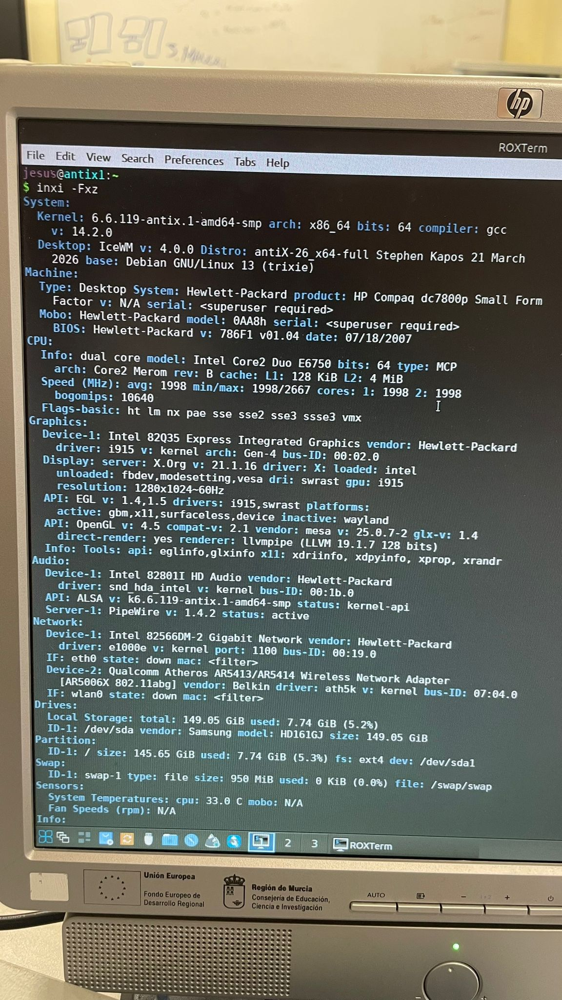
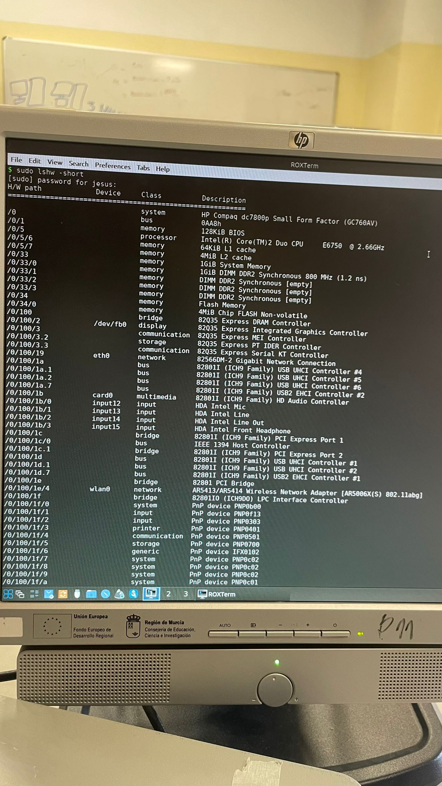
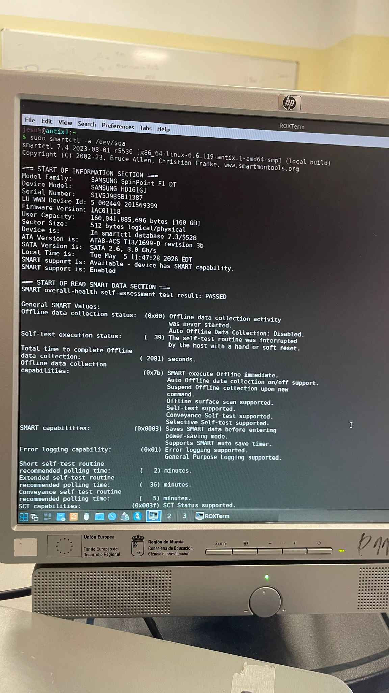
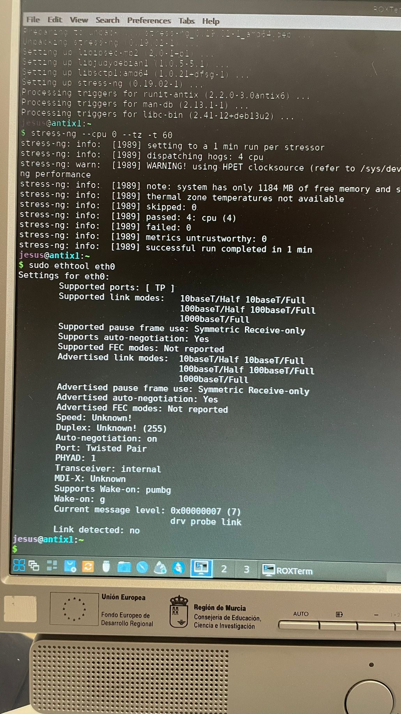
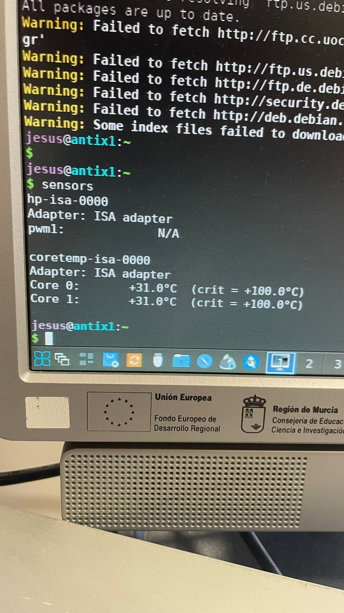
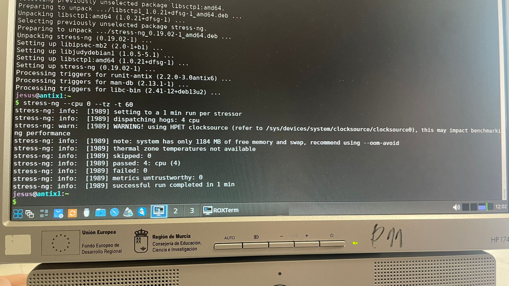

### 1. Datos Generales e Identificación

| **Campo**                        | **Detalle**                 |
| ---------------------------------- | ----------------------------- |
| **Fecha de comprobación:**      | [11/05/2026]                |
| **Alumno/a (Técnico):**         | [Yllán Cazorla Más]       |
| **Identificación del Equipo:**  | [HP Compaq dc7800 Equipo 1] |
| **Versión de Linux instalada:** | [Antix]                     |

### 2. Características del Hardware

| **Componente**              | **Especificaciones detectadas**             | **Comando Usado** | **Foto**                                    |
| ----------------------------- | --------------------------------------------- | ------------------- | --------------------------------------------- |
| **Procesador (CPU):**       | Interl core2 Duo E6750 X64 2 nucleos 1998MHz        | `inxi -Fxz`       |  |
| **Memoria RAM:**            | 1GIB, DIMM, DDR2, 800Mhz                    | `lshw -short`     |   |
| **Almacenamiento (Disco):** | HDD, 149.05GiB, SAMSUNG                     | `inxi -Fxz, lsblk`  |  |
| **Tarjeta Gráfica (GPU):** | Graficos integrados Intel 82Q35       | `inxi -Fxz`       |  |
| **Tarjeta de Red:**         | Intel 82566DM-2 Gigabit network | `inxi -Fxz`       |  |

### 3. Comprobación de Diagnóstico y Estabilidad

| **Prueba**                 | **Resultado / Valores Obtenidos**                    | **Estado (Apto/Fallo)** | **Foto** |
| ---------------------------- | ------------------------------------------------------ | ------------------------- |--------------------------- |
| **Estado del Disco Duro:** | Sin errores    | Apto                    |     |
| **Estado de la RAM:**      | No se comprobo       | [ ]                     |       |
| **Comprobación de Red:**  | Funciona | Apto por cable                  |        |
| **Temperatura CPU:**                            | 31.0ºC                     |   Apto      |
| **Temperaturas (Carga):**  | No se comprobo      | [ ]                     |      |
| **Estabilidad General:**   | ¿Se apaga o congela bajo estrés? [NO]          | [ Funciona]                     |        |

### 4. Conclusión y Observaciones

| **Apartado**                | **Detalle**                                                                                                                                                      |
| ----------------------------- | ------------------------------------------------------------------------------------------------------------------------------------------------------------------ |
| **Incidencias detectadas:** | Solo se esta usando 1 slot de memoria RAM |
| **Medidas correctivas:**    | Para comprobar la red se uso mediante cable USB conectado a un movil para compartir internet                                  |

**CONCLUSIÓN FINAL DEL EQUIPO:**
*(Marca con una X la opción correspondiente)*

* [] **APTO:** El equipo funciona perfectamente, es estable y el hardware está sano.
* [X ] **APTO CON OBSERVACIONES:** El equipo es funcional, pero tiene limitaciones o defectos menores (ej.  disco duro con desgaste pero usable).
* [ ] **NO APTO:** El equipo presenta fallos críticos de hardware (RAM defectuosa, disco a punto de fallar, sobrecalentamiento extremo que apaga el equipo).
* [ ]
